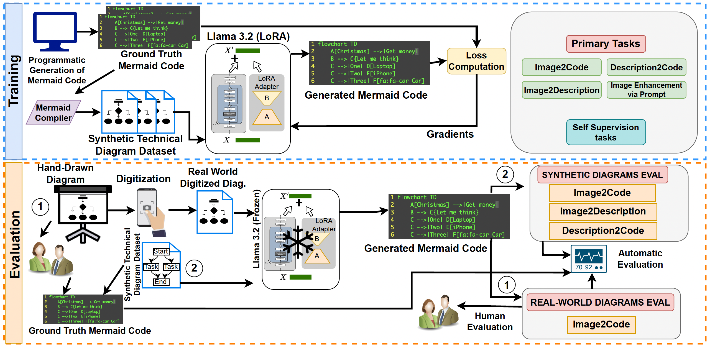

# TechING (Technical Image Understanding)



**Picture**: Overview of TechING

This repository contains the official implementation of the following paper:  
***TechING: Towards Real World Technical Image Understanding via VLMs***

**Authors:** *Tafazzul Nadeem\*, Bhavik Shangari\*, Manish Rai, Gagan Raj Gupta, Ashutosh Modi*

**Abstract:** *Professionals working in technical domain typically hand-draw 
(on whiteboard, paper, etc.) technical diagrams (e.g., flowcharts, block diagrams, 
etc.) during discussions; however, if they want to edit these later, it needs to 
be drawn from scratch. Modern day VLMs have made tremendous progress in image 
understanding but they struggle when it comes to understanding technical diagrams. 
One way to overcome this problem is to fine-tune on real world hand-drawn images, 
but it is not practically possible to generate large number of such images. 
In this paper, we introduce a large synthetically generated corpus (reflective 
of real world images) for training VLMs and subsequently evaluate VLMs on a 
smaller corpus of hand-drawn images (with the help of humans). We introduce 
several new self-supervision tasks for training and perform extensive experiments 
with various baseline models and fine-tune Llama 3.2 11B-instruct model on 
synthetic images on these tasks to obtain LLama-VL-TUG, which significantly 
improves the ROUGE-L performance of Llama 3.2 11B-instruct by 2.14x and achieves 
the best all-round performance across all baseline models. On real-world images, 
human evaluation reveals that we achieve minimum compilation errors across all 
baselines in 7 out of 8 diagram types and improve the average F1 score of Llama 
3.2 11B-instruct by 6.97x.*

## Training Methodology
We fine-tuned Llama3.2-11B-Vision-Instruct using LoRA (image encoder as well as
text decoder) on the combination of Primary and Self Supervision tasks (described below)
using D1 and D2 corpus of [TechING](https://huggingface.co/datasets/Exploration-Lab/TechING) dataset.

**Primary Tasks**
1. **Image2Code**: Generating corresponding [Mermaid](https://mermaid.js.org/) code for a given image.
2. **Description2Code**: Converting natural language descriptions into Mermaid code.
3. **Image2Description**: Generating Descriptions from technical diagram images.
4. **Image Enhancement via Prompt**: Generating Mermaid code of the updated image, given
   an image and a natural language enhancement prompt.

**Self Supervision Tasks**
1. **Image Enhancement via Description**: Given an image along with a textual
   description of the target image, produce code that reflects the enhanced description.
2. **Code Enhancement via Prompt**: Given a Mermaid code along with an enhancement
   prompt, update the code accordingly.
3. **Code Enhancement via Description**: Given a Mermaid code snippet along with a natural
  language description of the target image, enhance the code to accurately reflect
  the changes present in the description.
4. **Positive/Negative Image–Code Pair Q&A**: Predict given image–code pair
   constitutes a valid match or a mismatch.
5. **Partial Match Image–Code Pair Q&A**: Identify partial matches between incomplete
   and complete image-code pairs.

## Evaluation Results
The radar charts present ROUGE-L performance across the 
three primary tasks on the D1 test set, comparing LLama-VL-TUG 
against baselines of comparable model size. Detailed results are 
provided in our paper, [TechING: Towards Real World Technical Image Understanding via VLMs](https://arxiv.org/abs/2601.18238).


## Citation

[**TechING: Towards Real World Technical Image Understanding via VLMs**](https://2026.eacl.org/), In the 19th Conference of the 
European Chapter of the Association for Computational Linguistics (EACL) to be held in Rabat, Morocco, from March 24–29, 2026.
```
@misc{nadeem2026techingrealworldtechnical,
      title={TechING: Towards Real World Technical Image Understanding via VLMs}, 
      author={Tafazzul Nadeem and Bhavik Shangari and Manish Rai and Gagan Raj Gupta and Ashutosh Modi},
      year={2026},
      eprint={2601.18238},
      archivePrefix={arXiv},
      primaryClass={cs.CL},
      url={https://arxiv.org/abs/2601.18238}, 
}
```

\*Equal Contribution
